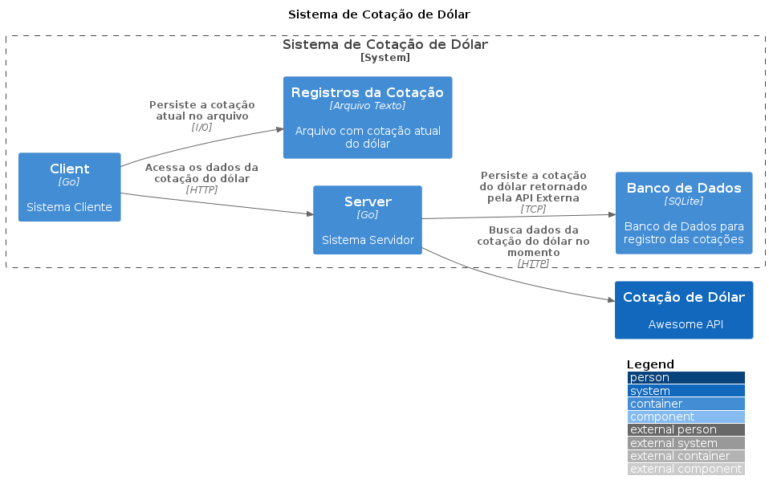

# Cotação Dolar

Este é um desafio para aplicar os conceitos aprendidos sobre webserver http, contextos, banco de dados e manipulação de arquivos com Go.

## Objetivo

O objetivo deste desafio é criar uma aplicação que permita consultar a cotação do dólar em tempo real, gravar essa cotação em um banco de dados e também salvar a cotação em um arquivo de texto.

## Arquitetura do projeto

